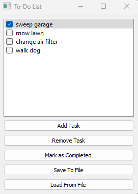

# To-Do List Application

A simple To-Do List desktop application built using PyQt5.



## Features

- Add tasks to the list
- Remove tasks from the list
- Mark tasks as completed
- Save the list to a file
- Load tasks from a file

## Installation

1. Clone this repository:
```bash
git clone https://github.com/Dolvido/todo-app.git
```

2. Navigate to the project directory:
```bash
cd todo-app
```

3. Install the required packages:
```bash
pip install pyqt5 pyqt5-tools
```

4. Run the application:
```bash
python 'todo app.py'
```

## Usage

1. **Add Task**: Click on the "Add Task" button and input your task.
2. **Remove Task**: Select a task and click on the "Remove Task" button.
3. **Mark as Completed**: Select a task and click on the "Mark as Completed" button.
4. **Save To File**: Click on the "Save To File" button and choose where to save your tasks.
5. **Load From File**: Click on the "Load From File" button and select a previously saved task file.

## Contributing

Pull requests are welcome. For major changes, please open an issue first to discuss what you would like to change.

Please make sure to update tests as appropriate.

## License

[MIT](https://choosealicense.com/licenses/mit/)
```

Remember to replace `yourusername` with your actual GitHub username.
